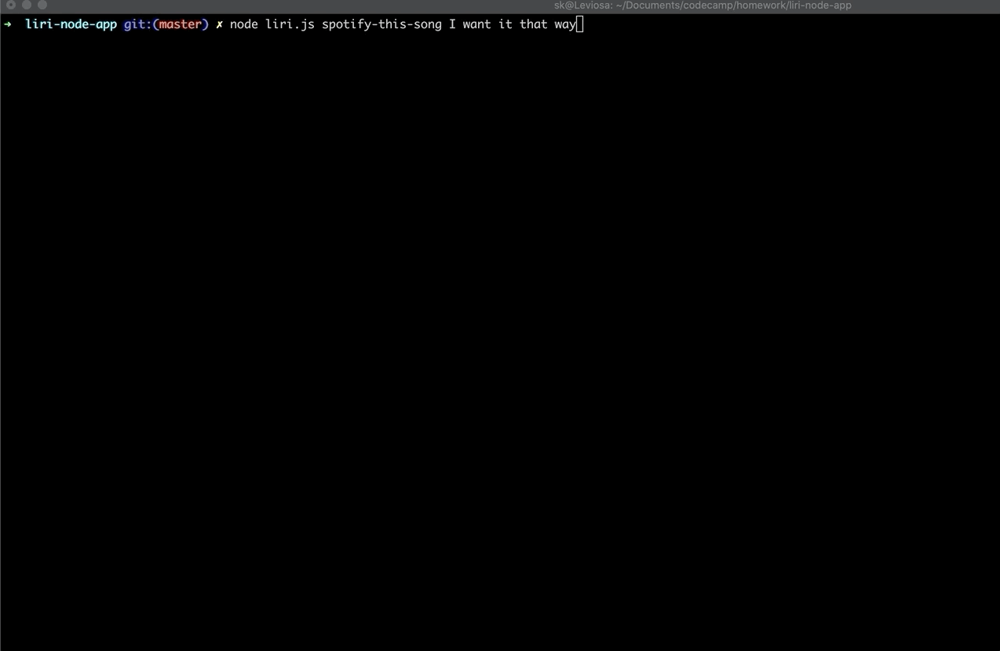
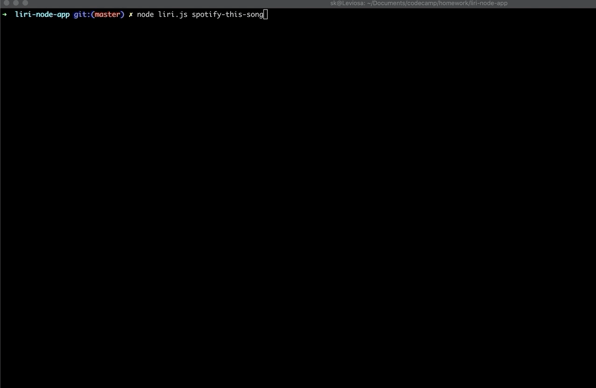

# liri-node-app

A CLI app to retreive one of the following - 

1. Upcoming concerts for an artist using the bandsintown API
2. Information regarding a song for the first 20 results from spotify. 
3. Information regarding a movie from the omdb API
4. Run the command listed in the random.txt file 

## App Architecture 

The soure lives in [liri.js](./liri.js). Each requirement is contained in its own function. The following functions are defined: 

### Functions

1. `spotify()`
2. `concert()`
3. `movie()`
4. `dowit()`

## How to use

### To run command for searching 
```bash
node liri.js [spotify-this-song|concert-this|movie-this] search term
```




### To run command from random.txt file

```bash
node liri.js do-what-it-says
```

## Role in development
Shveta Kumar: Developer